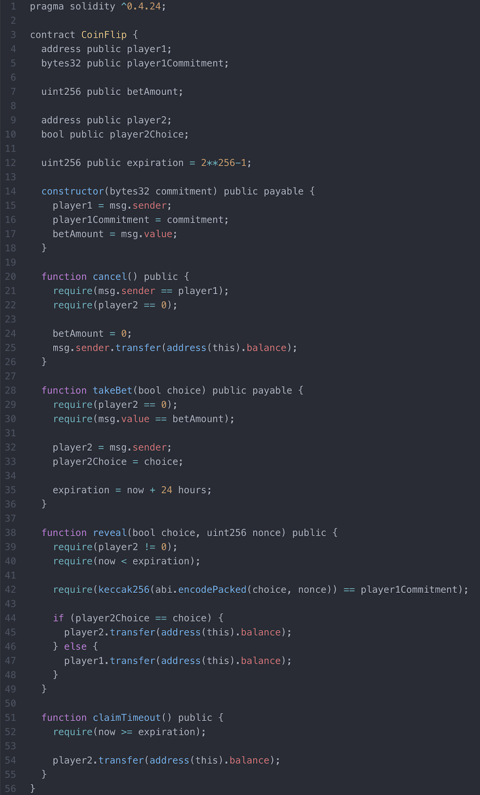

# HW3 - What Would Solidity Print?

Written by Jenny Cong, Edited by Minxing Chen and Simon Guo.

### `CoinFlip` Solidity Smart Contract Code 

### Set Up

Assume there is a `print()` function in Solidity that takes in any variable and prints a human-readable representation of the variable without quotes regardless of public/private access. 

Assume gas is zero. Currently, Tim has 10 ether. Matt has 10 ether. Minxing has 10 ether. 

### What Would Solidity Print?

Consider the following questions happening in a single environment, meaning, question 2 happened after the action of question 1 has taken place.

**Question 1**

Tim’s address is `0xd95e068a69045ece32eecad394d86a9ac7b832ca`. 

Tim hashed `abi.encodePacked(true, “12345678")` with keccak256 and got `“c844hfksjc9didvnrrmf4hdusjznryfu”` (Don’t worry if you don’t understand this part.) 

Tim called `constructor(“c844hfksjc9didvnrrmf4hdusjznryfu”)` with a value of 1 ether. 

You called `print(player1)`. 

What would Solidity print?

<u>Answer:</u> `0xd95e068a69045ece32eecad394d86a9ac7b832ca`

**Question 2**

Minxing’s address is `0x4d6dd6a6471123dd54f45088c991a5aac0c9ef01`. 

Minxing called `takeBet(true)` with a value of 2 ether. 

You called `print(player2)`. 

What would Solidity print?

<u>Answer:</u> 0x0000000000000000000000000000000000000000

**Question 3**

Matt’s address is `0xbbab9d85b4eca79ec9f0e4595681f3a025b5e3f6`. 

Matt called `takeBet(false)` with a value of 1 ether. 

You called `print(player2)`. 

What would Solidity print?

<u>Answer:</u> 0xbbab9d85b4eca79ec9f0e4595681f3a025b5e3f6

**Question 4**

Tim called `reveal(true, “12345678”)`. 

What is Matt's ether balance now?

<u>Answer:</u> 9 ether

**Question 5**

What is Tim's ether balance now?

<u>Answer:</u> 11 ether

### Check Off

Submit the quiz on [Google form](https://docs.google.com/forms/d/e/1FAIpQLScFLnEo71COZ8mTXL5ZCMTAuzZDHNbTRWivbGE4lnkFkCdAoA/closedform).