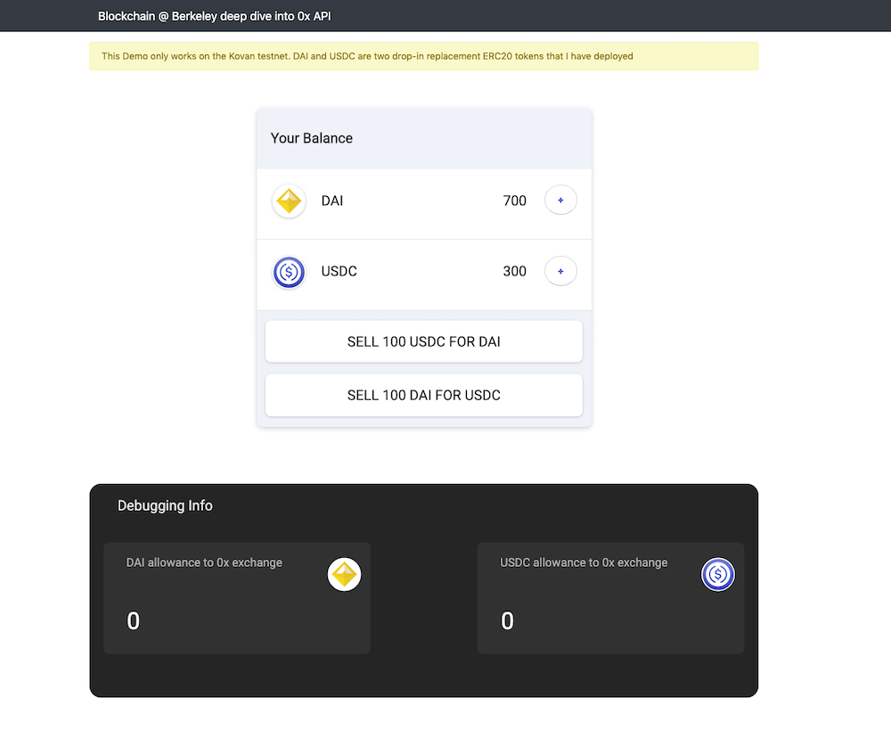
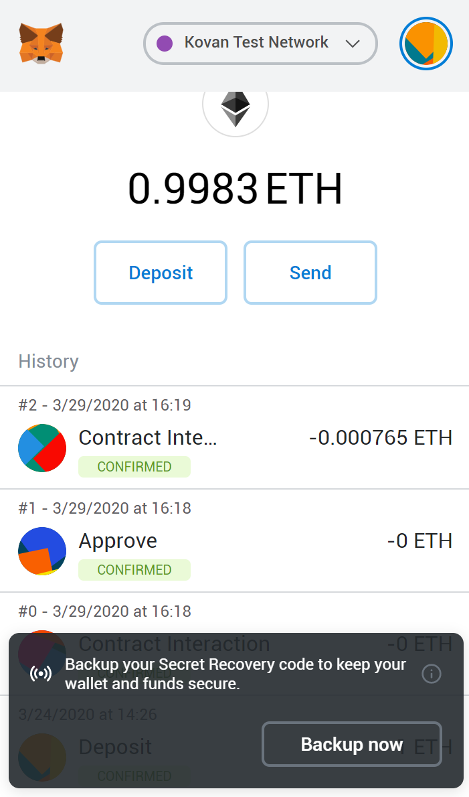

## HW7 Create Your Own Exchange

Written by [Daniel Pyrathon](https://github.com/PirosB3), the [0x](https://0x.org/) team, and Simon Zirui Guo.

### Prerequisites

Before the lecture, please do the following:

* Install [Metamask](https://metamask.io/) (on Chrome) and create a new account (optionally, re-use an existing account)
* Install [VSCode](https://code.visualstudio.com/) (Will make programming in TypeScript much easier)
* **Important!** Mint some KETH by using the [faucet](https://faucet.kovan.network/), or by pasting your address in the [Kovan Gitter](https://gitter.im/kovan-testnet/faucet), please ensure that you have at least 1-2 ETH.
* Install NodeJS, preferably v10.15.3 or higher. If you use Linux as an OS, please ensure that your NodeJS has all the shared libraries, compilers, in order to install packages with native C code.
* Revise [ERC20 token allowances](https://tokenallowance.io/)
* Register for an [Infura account](https://infura.io/) (free)
* Make sure you are comfortable working with JavaScript. You should be familiar with concepts such as promises, `async`/`await` syntax, anonymous functions (or callbacks)
* Optional: [Learn the basics of TypeScript](https://www.typescriptlang.org/docs/handbook/typescript-in-5-minutes.html)

### Homework Detail

In this homework, you will build your own DeFi application, which is an exchange that uses [0x API](https://0x.org/api) to easily swap between [DAI](https://makerdao.com/en/) and [USDC](https://www.centre.io/usdc).

**Proceed** to [this repo](https://github.com/PirosB3/Blockchain-Lecture-UC-Berkeley) and **clone** it to get started. Shout out to [Daniel Pyrathon](https://github.com/PirosB3) and the 0x team for creating this coding assignment.

Before you proceed, we highly recommend you watch the lecture recording of the technical walkthrough.

### Check Off

Email us a screenshot of your exchange web app after successfully swapping DAI and USDC. It should look something like this.

In addition, please send us a screenshot of your MetaMask. It should look like something like this. 

